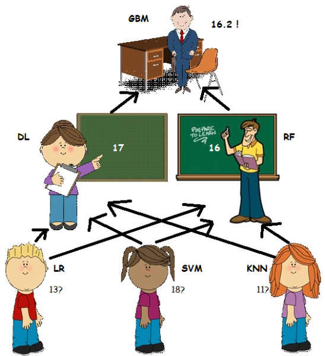

```{r setup, include=FALSE}
knitr::opts_chunk$set(echo = FALSE, warning=FALSE, message=FALSE)
```

## Timeline

Model history with [`leadr`](https://github.com/tmastny/leadr):

```{r, echo=FALSE}
library(leadr)
library(tidyverse)
b <- board()
ggplot(b, aes(x = id, y = score)) + 
  geom_line() +
  labs(x = NULL, y = "Accuracy")
```

## Ensembles of Ensembles

```{r echo=FALSE, fig.align='center', out.width = "400px"}

```

## Effect of Ensembles

```{r}
b %>% 
  mutate(
    cat_ensemble = case_when(
      str_detect(dir, "c-") ~ "lvl1 ensembles",
      str_detect(dir, "cat") ~ "base",
      str_detect(dir, "l2") ~ "lvl2 ensembles",
      TRUE ~ "other"
    )) %>%
  filter(cat_ensemble != "other") %>%
  ggplot(aes(x = id, y = score, color = cat_ensemble)) + 
  geom_line()
```

## Model Types

```{r}
b %>%
  filter(score >= 0.88) %>%
  ggplot(aes(x = id, y = score, color = model)) + 
  geom_line()
```


